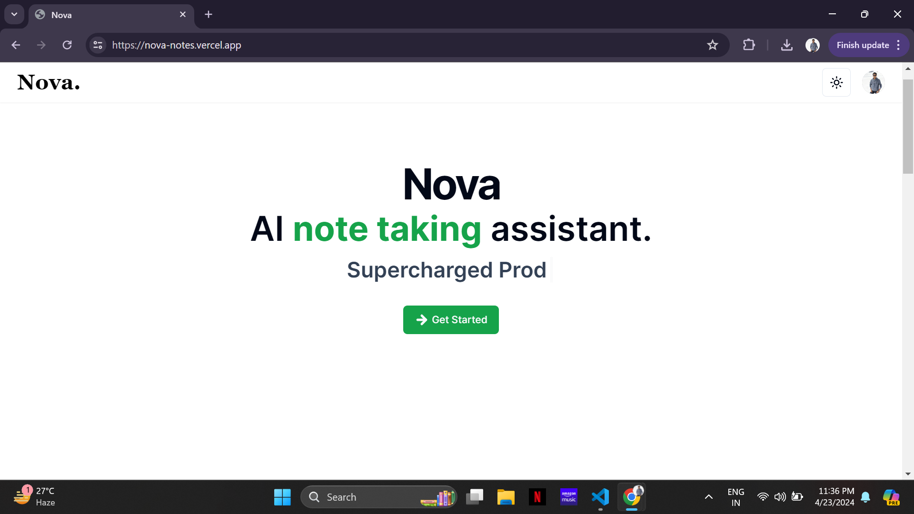

# Nova



## Description

Nova is an AI notes taking assistant web application that simplifies note-taking by providing auto-completion for your notes and generating images to enhance your notes. It leverages OpenAI's GPT-4 API to assist you in creating comprehensive notes efficiently.

<!-- Add project features is My AI -->

## Features

- Auto-completion for note-taking using OpenAI's GPT-4 API
- Generate thumbnail images to complement your notes
- Responsive design for seamless use on various devices.
- Easy and friendly to use.
- Dark and light theme to enhance UI.

<!-- Add project technologies is My AI -->

## Technologies

Project is created with:

<!-- add stripe substiption -->
- Next.js
- Tailwind CSS
- OpenAI API
- Clerk Authentication
- Shadcn-ui
- Firebase
- Drizzle-orm
- NeonDb 
<!-- Add project setup is My AI -->

## Setup

To run this project, install it locally using npm:

```
$ cd ai-notes
$ npm install
```
Rename the .env.example to .env
```
$ npm run dev
```

<!-- Add project status is My AI -->

## Status

Project is: _Done_

<!-- Add project contribution is My AI -->

## Contribution

Contributions are always welcome!

<!-- Add project support is My AI -->

## Support

Give a ⭐️ if you like this project!